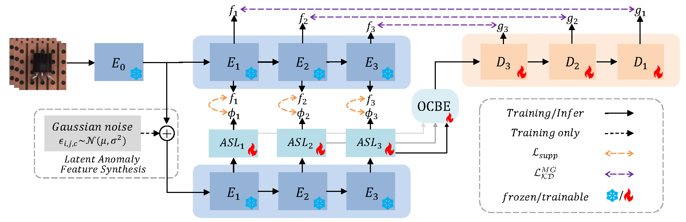

# Anomaly Detection and Localization via Reverse Distillation with Latent Anomaly Suppression

Official PyTorch implementation of the TCSVT 2025 paper:  "Anomaly Detection and Localization via Reverse Distillation with Latent Anomaly Suppression" [](https://ieeexplore.ieee.org/document/10969994)



This work proposes REverse distillation with latent Anomaly SuppressiON (REASON) approach for image anomaly detection and localization, effectively addressing the issue of potential anomaly pattern leakage in the RD paradigm.

## Datasets Preparation

Place the datasets under the root directory as follows:

- **MVTec AD**  
  Download from: [https://www.mvtec.com/company/research/datasets/mvtec-ad/](https://www.mvtec.com/company/research/datasets/mvtec-ad/)  
  Unpack into `./mvtec/` so that the structure becomes:
  ```
  ./mvtec/
    ├── bottle/
    ├── cable/
    ├── capsule/
    └── ... (15 categories)
  ```

- **OCT2017**  
  Download from: [https://data.mendeley.com/datasets/rscbjbr9sj/2](https://data.mendeley.com/datasets/rscbjbr9sj/2)  
  Extract the `OCT2017` folder into the code root.

- **AeBAD**  
  Download from: [Google Drive (access code: g4pr)](https://drive.google.com/file/d/14wkZAFFeudlg0NMFLsiGwS0E593b-lNo/view)  
  AeBAD includes two subsets:
  - `AeBAD-S`: single-image industrial inspection
  - `AeBAD-V`: video-based anomaly detection  

## Environment

```text
torch == 1.10.1
torchvision == 0.14.1
numpy == 1.20.3
scipy == 1.7.1
scikit-learn == 1.0
Pillow == 8.3.2
```

## Training & Evaluation

- **MVTec AD and OCT2017**:  
  ```bash
  python main.py or python main_oct.py
  ```
  Inference and visualization: `test.py`, `visualize.py` ,`visualize_oct2017.py`

- **AeBAD**:  
  Follow the [MMR](https://github.com/zhangzilongc/MMR) pipeline, the core REASON model implementation is identical to the one provided in this repository.

## Citation

Please cite our paper if you find it's helpful in your work.

```bibtex
@article{wang2025reason,
  author  = {Wang, Gang and Zou, Yisheng and He, Songlin and Wang, Yakun and Dai, Ruihong},
  title   = {Anomaly Detection and Localization via Reverse Distillation with Latent Anomaly Suppression},
  journal = {IEEE Transactions on Circuits and Systems for Video Technology},
  year    = {2025},
  volume  = {35},
  number  = {10},
  pages   = {9592--9607}
}
```

## Acknowledgements

Our implementation is based on the [RD4AD](https://github.com/hq-deng/RD4AD) baseline, with references to the [RD++](https://github.com/tientrandinh/Revisiting-Reverse-Distillation) and [MMR](https://github.com/zhangzilongc/MMR) codebases. We sincerely thank the authors for their excellent work!

